## Design Modelling

## UML Models Overview
This document provides the visual architecture models for the Unified Patient
Access and Clinical Intelligence Platform. Diagrams are derived from
[spec.md](.propel/context/docs/spec.md) (use cases UC-001 through UC-006) and
[design.md](.propel/context/docs/design.md) (architecture decisions, domain
entities, AI requirements, and technology stack). The document is organized
into architectural views followed by one sequence diagram per use case.

Because the architecture includes hybrid AI workflows, additional AI-assisted
subflow diagrams are included for intake assistance, no-show risk scoring,
clinical extraction, and retrieval-backed coding recommendations.

## Architectural Views

### System Context Diagram
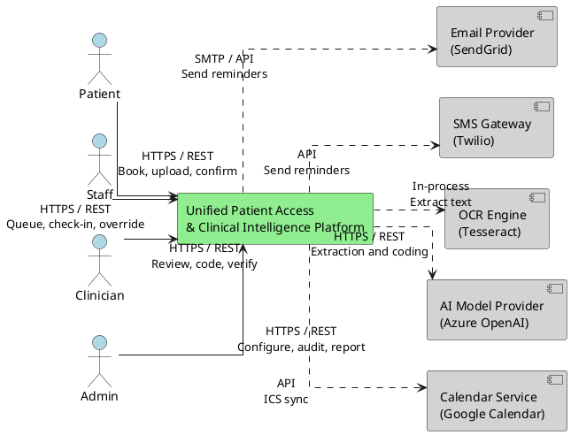

### Component Architecture Diagram
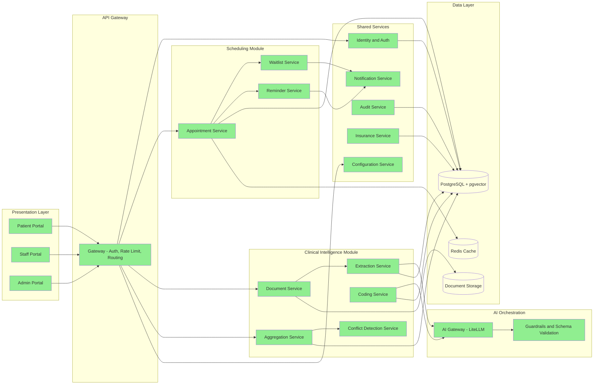

### Deployment Architecture Diagram
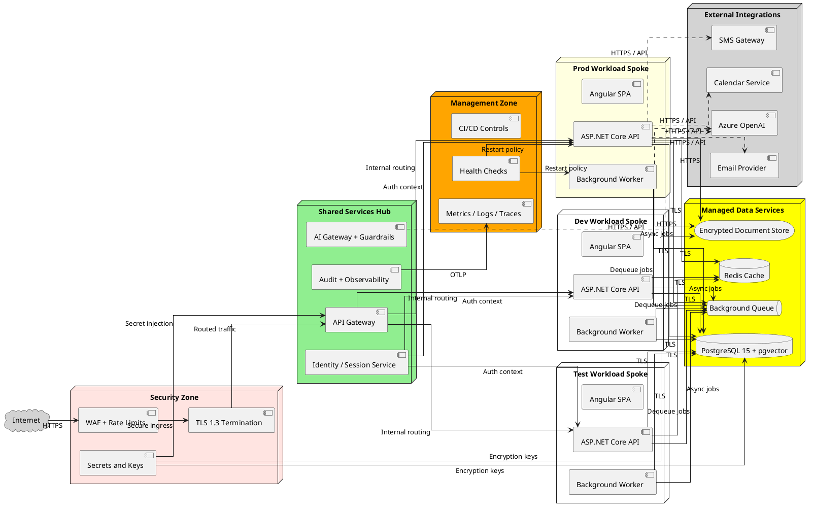

### Data Flow Diagram
```plantuml
@startuml
!define PROCESS rectangle
!define DATASTORE database
!define EXTERNAL component

EXTERNAL "Patient / Staff" as user
EXTERNAL "Clinician" as clinician
EXTERNAL "Admin" as admin

PROCESS "Appointment\nBooking" as booking
PROCESS "Reminder\nEngine" as reminder
PROCESS "Document\nUpload" as upload
PROCESS "OCR and\nExtraction" as ocr
PROCESS "Aggregation\nand Conflict" as agg
PROCESS "Coding\nSuggestion" as coding
PROCESS "Audit\nLogger" as audit

DATASTORE "Appointment DB" as apptdb
DATASTORE "Document Store" as docstore
DATASTORE "Clinical Data DB" as clindb
DATASTORE "Audit Store" as auditdb
DATASTORE "Redis Cache" as cache

EXTERNAL "Email / SMS" as notify
EXTERNAL "Azure OpenAI" as ai

user -> booking : Search and book slots
booking -> apptdb : Persist appointment
booking -> cache : Cache available slots
booking -> reminder : Schedule reminders
reminder -> notify : Send email and SMS
reminder -> apptdb : Update confirmation

user -> upload : Upload documents
upload -> docstore : Store files
upload -> ocr : Trigger processing
ocr -> ai : Request extraction
ai -> ocr : Extracted entities
ocr -> clindb : Persist clinical facts

clinician -> agg : View 360 profile
agg -> clindb : Read clinical data
agg -> docstore : Fetch source docs
agg -> coding : Request code suggestions
coding -> ai : Generate ICD-10 / CPT
ai -> coding : Suggestions with rationale
clinician -> coding : Accept / modify / reject
coding -> clindb : Finalize decisions

admin -> audit : Review logs
audit -> auditdb : Read audit records

booking -> audit : Log booking events
ocr -> audit : Log extraction events
coding -> audit : Log coding decisions
@enduml
```

### Logical Data Model (ERD)
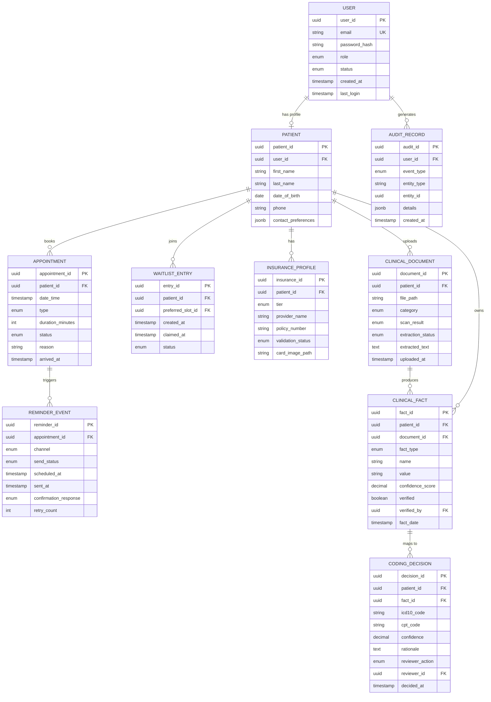

### AI Architecture - RAG and Hybrid Pipeline
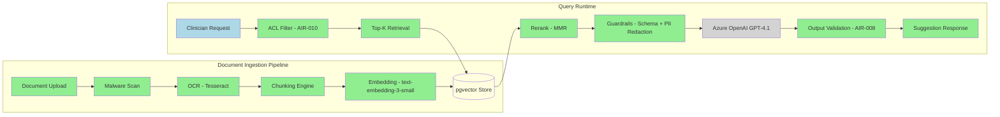

### Use Case Sequence Diagrams

#### UC-001: Register and Authenticate User
**Source**: [spec.md#UC-001](.propel/context/docs/spec.md#UC-001)

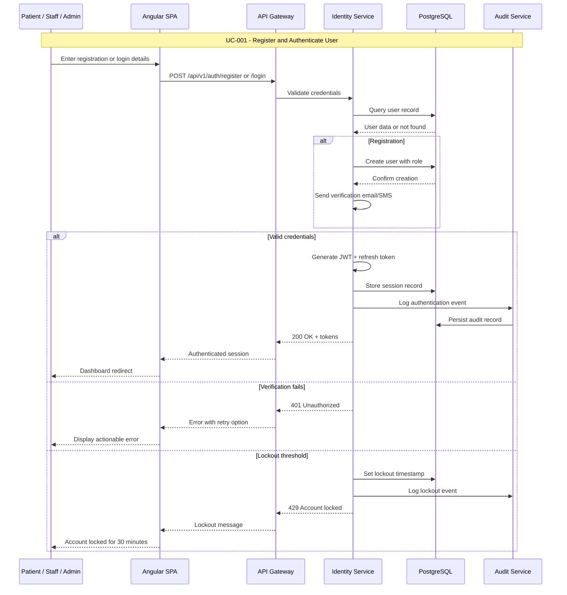

#### UC-002: Search, Book, and Confirm Appointment
**Source**: [spec.md#UC-002](.propel/context/docs/spec.md#UC-002)

```mermaid
sequenceDiagram
    participant Actor as Patient / Staff
    participant SPA as Angular SPA
    participant GW as API Gateway
    participant Appt as Appointment Service
    participant WL as Waitlist Service
    participant Cache as Redis Cache
    participant DB as PostgreSQL
    participant Notif as Notification Service
    participant Email as Email Provider
    participant Cal as Calendar Service

    Note over Actor,Cal: UC-002 - Search, Book, and Confirm Appointment

    Actor->>SPA: Search slots by date, duration, type
    SPA->>GW: GET /api/v1/appointments/slots
    GW->>Appt: Forward search request
    Appt->>Cache: Check cached availability
    Cache-->>Appt: Cached slots or miss
    Appt->>DB: Query available slots
    DB-->>Appt: Eligible slot list
    Appt-->>GW: Return slots + intake form
    GW-->>SPA: Display available slots
    SPA-->>Actor: Show slots and intake form

    Actor->>SPA: Complete intake and confirm booking
    SPA->>GW: POST /api/v1/appointments
    GW->>Appt: Create booking
    Appt->>DB: Reserve slot atomically
    DB-->>Appt: Booking confirmed
    Appt->>Cache: Invalidate slot cache
    Appt->>Notif: Send confirmation
    Notif->>Email: Email with PDF + QR + ICS
    Notif->>Cal: Export ICS attachment
    Appt-->>GW: 201 Created + confirmation
    GW-->>SPA: Booking confirmation
    SPA-->>Actor: Display confirmation with PDF

    alt No slots available
        Appt-->>GW: No availability
        GW-->>SPA: Offer waitlist
        Actor->>SPA: Join preferred-slot waitlist
        SPA->>GW: POST /api/v1/waitlist
        GW->>WL: Create waitlist entry
        WL->>DB: Persist waitlist entry
        WL-->>GW: 201 Waitlist confirmed
        GW-->>SPA: Waitlist confirmation
    end
```

#### UC-003: Manage Reminder and Preferred Slot Workflow
**Source**: [spec.md#UC-003](.propel/context/docs/spec.md#UC-003)

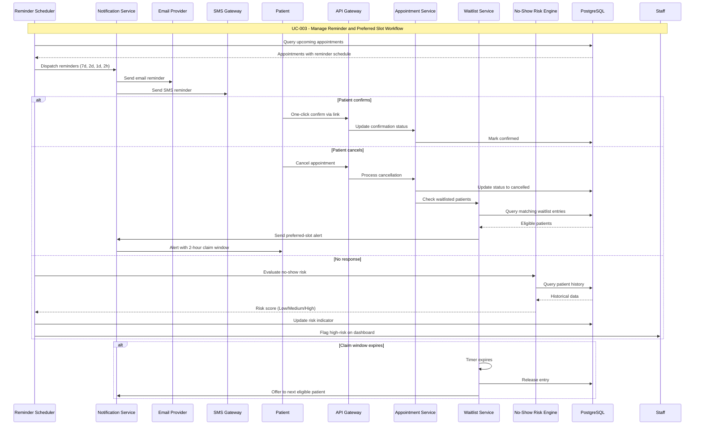

#### UC-004: Upload and Process Clinical Documents
**Source**: [spec.md#UC-004](.propel/context/docs/spec.md#UC-004)

```mermaid
sequenceDiagram
    participant Actor as Patient / Staff
    participant SPA as Angular SPA
    participant GW as API Gateway
    participant Doc as Document Service
    participant Store as Document Storage
    participant Queue as Background Queue
    participant Worker as Extraction Worker
    participant OCR as OCR Engine
    participant AIGW as AI Gateway
    participant LLM as Azure OpenAI
    participant DB as PostgreSQL
    participant Audit as Audit Service
    participant Clinician as Clinician

    Note over Actor,Clinician: UC-004 - Upload and Process Clinical Documents

    Actor->>SPA: Select and upload document
    SPA->>GW: POST /api/v1/documents (multipart)
    GW->>Doc: Validate file type, size
    Doc->>Doc: Malware scan
    alt Invalid or infected
        Doc-->>GW: 400 Rejected with reason
        GW-->>SPA: Display rejection error
        SPA-->>Actor: Show error message
    end
    Doc->>Store: Persist encrypted file
    Store-->>Doc: Storage path
    Doc->>DB: Create document record (status: processing)
    Doc->>Queue: Enqueue extraction job
    Doc-->>GW: 202 Accepted
    GW-->>SPA: Upload confirmed, processing
    SPA-->>Actor: Show processing status

    Queue->>Worker: Dequeue job
    Worker->>Store: Retrieve document
    Worker->>OCR: Run OCR extraction
    OCR-->>Worker: Raw extracted text
    Worker->>AIGW: Request structured extraction
    AIGW->>LLM: Prompt with redacted context
    LLM-->>AIGW: Structured entities + confidence
    AIGW-->>Worker: Validated extraction output
    Worker->>DB: Persist clinical facts with confidence
    Worker->>DB: Update document status (completed)
    Worker->>Audit: Log extraction event

    alt Low confidence detected
        Worker->>DB: Flag for manual review
    end

    Clinician->>SPA: Open document review
    SPA->>GW: GET /api/v1/documents/{id}
    GW->>Doc: Retrieve document and facts
    Doc->>DB: Query clinical facts
    DB-->>Doc: Facts with confidence scores
    Doc-->>GW: Document + extracted data
    GW-->>SPA: Display for review
    Clinician->>SPA: Edit and verify data
    SPA->>GW: PUT /api/v1/clinical-facts/{id}
    GW->>Doc: Update verified status
    Doc->>DB: Persist with audit trail
    Doc->>Audit: Log verification event
```

#### UC-005: Review Profile, Conflicts, and Coding Suggestions
**Source**: [spec.md#UC-005](.propel/context/docs/spec.md#UC-005)

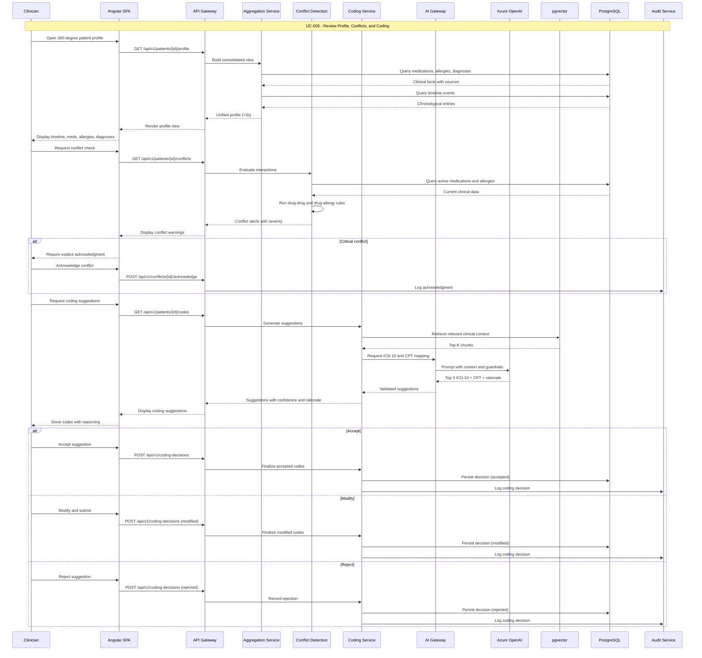

#### UC-006: Administer Platform and Compliance Reporting
**Source**: [spec.md#UC-006](.propel/context/docs/spec.md#UC-006)

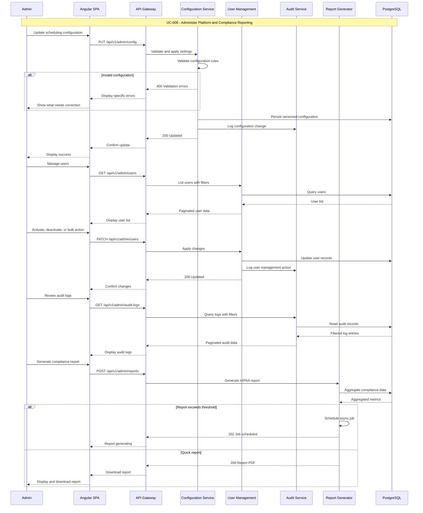

### AI-Assisted Sequence Diagrams

#### UC-002 AI Subflow: AI-Assisted Intake Capture
**Source**: [spec.md#UC-002](.propel/context/docs/spec.md#UC-002)

```mermaid
sequenceDiagram
    participant Actor as Patient / Staff
    participant SPA as Angular SPA
    participant GW as API Gateway
    participant Intake as Intake Orchestrator
    participant Guard as AI Guardrails
    participant LLM as Azure OpenAI
    participant DB as PostgreSQL

    Note over Actor,DB: UC-002 AI Subflow - AI-Assisted Intake Capture

    Actor->>SPA: Request AI assistance for intake
    SPA->>GW: Submit draft intake data
    GW->>Intake: Create assistance request
    Intake->>Guard: Redact unnecessary identifiers
    Guard->>LLM: Structured intake completion prompt
    LLM-->>Guard: Suggested fields and rationale
    Guard-->>Intake: Schema-validated response

    alt Confidence above threshold
        Intake->>DB: Autosave suggested intake values
        Intake-->>GW: Assisted draft ready
    else Confidence below threshold
        Intake-->>GW: Manual workflow required
    end

    GW-->>SPA: Render assisted or manual intake path
```

#### UC-003 AI Subflow: No-Show Risk Scoring
**Source**: [spec.md#UC-003](.propel/context/docs/spec.md#UC-003)

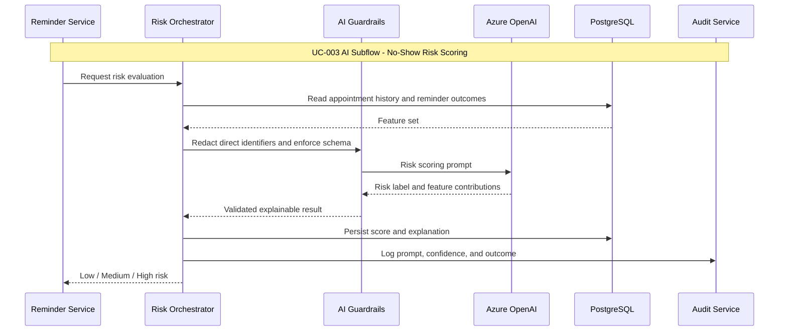

#### UC-004 AI Subflow: OCR and Clinical Extraction
**Source**: [spec.md#UC-004](.propel/context/docs/spec.md#UC-004)

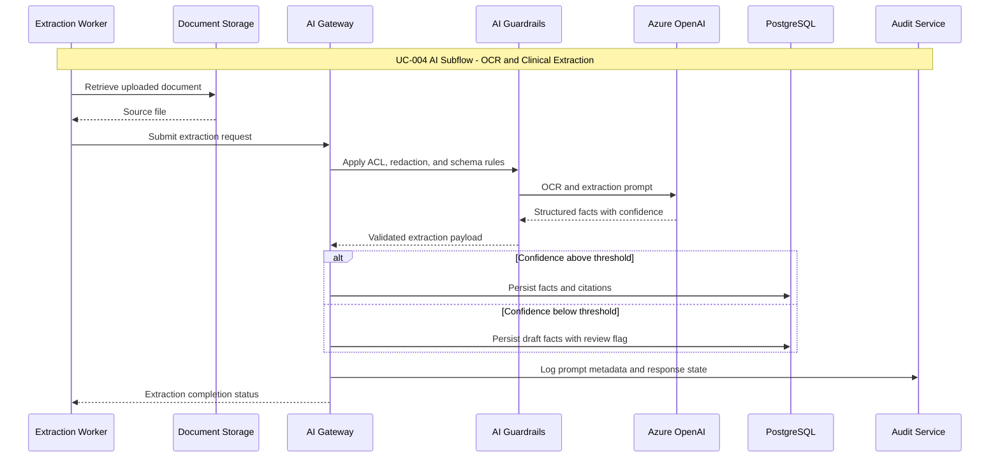

#### UC-005 AI Subflow: Retrieval-Backed Coding Suggestions
**Source**: [spec.md#UC-005](.propel/context/docs/spec.md#UC-005)

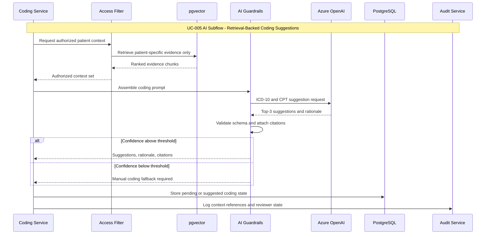
