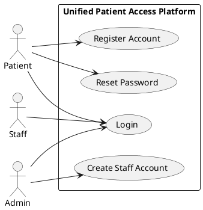
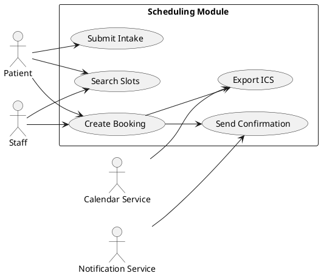
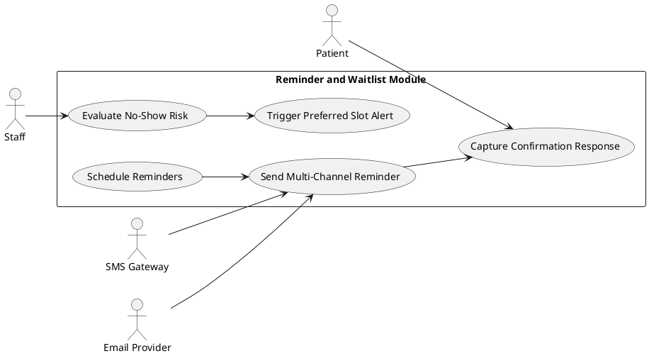
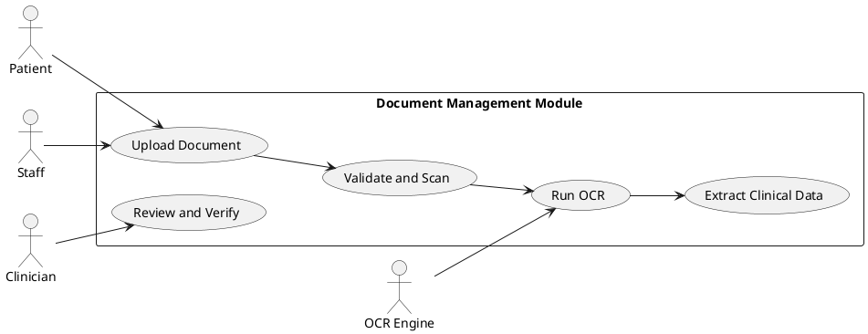
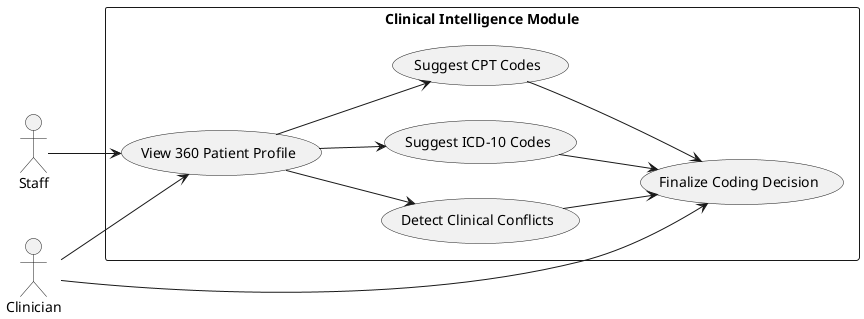
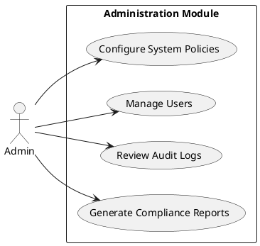

## Requirements Specification

## Feature Goal
Build a Unified Patient Access and Clinical Intelligence Platform that enables
patients to self-schedule appointments, receive automated reminders, and upload
clinical documents while enabling staff to manage operations and clinicians to
review AI-assisted, transparent coding and conflict detection outputs in a
single, compliant system.

## Business Justification
- Reduce operational loss from no-shows by improving reminder coverage,
  preferred-slot waitlist automation, and low-friction digital booking.
- Decrease staff and clinical preparation time through centralized scheduling,
  document processing, and 360-degree patient profile aggregation.
- Improve claim outcomes with Trust-First AI-assisted ICD-10/CPT suggestions
  that expose rationale and preserve human-in-the-loop review.
- Strengthen compliance readiness with immutable audit trails, access logging,
  retention controls, and security-by-default requirements.

## Feature Scope
The platform provides:
- Multi-role access for Patient, Staff, and Admin users.
- Appointment discovery, booking, reschedule, cancel, and waitlist swap.
- Automated reminders via email/SMS and patient confirmation actions.
- Front-desk operations for queue, arrivals, walk-ins, and overrides.
- Insurance soft validation and secure insurance data storage.
- Clinical document upload, OCR processing, categorization, and viewing.
- Clinical extraction and profile aggregation with conflict detection.
- Trust-First coding workflows for ICD-10 and CPT suggestions.
- Administration, observability, and compliance reporting.

Out of scope for this spec:
- Provider login workflows, payment gateway, family profiles.
- Direct EHR integration and claims submission.

### Success Criteria
- [ ] No-show rate improves from 15% to less than 5%.
- [ ] Staff time per appointment improves from 25 minutes to 10 minutes.
- [ ] Clinical prep time improves from 20 minutes to 2 minutes.
- [ ] Online booking adoption reaches at least 70%.
- [ ] AI-human coding agreement reaches greater than 98%.
- [ ] Data extraction accuracy reaches greater than 97%.

## Functional Requirements
- FR-UM-001 [DETERMINISTIC]: System MUST provide patient self-registration via
  email or phone verification with completion target under 30 seconds.
- FR-UM-002 [DETERMINISTIC]: System MUST enforce role-based access control for
  Patient, Staff, and Admin roles with access events recorded in audit logs.
- FR-UM-003 [DETERMINISTIC]: System MUST allow admins to invite, activate, and
  deactivate staff accounts through controlled workflows.
- FR-UM-004 [DETERMINISTIC]: System MUST enforce a 15-minute session timeout,
  show a warning 2 minutes before timeout, and limit users to one active
  session.
- FR-UM-005 [DETERMINISTIC]: System MUST support password reset by email and
  lock accounts for 30 minutes after 5 failed login attempts.

- FR-AS-001 [DETERMINISTIC]: System MUST allow appointment slot search within
  a 30-day window and support 15, 30, and 60 minute appointment durations.
- FR-AS-002 [HYBRID]: System MUST support intake capture using AI-assisted or
  manual entry mode with autosave and edit capability.
- FR-AS-003 [DETERMINISTIC]: System MUST issue booking confirmation in under
  one minute with PDF summary, QR code, and ICS calendar attachment.
- FR-AS-004 [DETERMINISTIC]: System MUST allow patients to reschedule or cancel
  appointments up to 24 hours before visit time and allow staff override.
- FR-AS-005 [DETERMINISTIC]: System MUST maintain preferred-slot waitlists,
  notify eligible patients, and apply a 2-hour claim window before release.
- FR-AS-006 [DETERMINISTIC]: System MUST support calendar synchronization using
  ICS export and Google Calendar integration.
- FR-AS-007 [DETERMINISTIC]: System MUST provide appointment history with date
  and status filters and PDF export.

- FR-RN-001 [DETERMINISTIC]: System MUST send automated reminders at 7d, 2d,
  1d, and 2h before appointment over configured channels.
- FR-RN-002 [AI-CANDIDATE]: System MUST generate no-show risk scores with
  Low, Medium, and High labels and provide staff-facing risk indicators.
- FR-RN-003 [DETERMINISTIC]: System MUST let patients configure notification
  channel and reminder timing preferences.
- FR-RN-004 [DETERMINISTIC]: System MUST issue immediate preferred-slot alerts
  with claim-window countdown support.

- FR-SO-001 [DETERMINISTIC]: System MUST provide a real-time queue dashboard
  with status color-coding and wait-time estimates.
- FR-SO-002 [DETERMINISTIC]: System MUST allow staff-only arrival check-in with
  one-click appointment state transitions.
- FR-SO-003 [DETERMINISTIC]: System MUST support walk-in creation, queue
  insertion, and conversion of walk-ins to registered patients.
- FR-SO-004 [DETERMINISTIC]: System MUST allow staff override of scheduling
  constraints only with mandatory reason capture and audit entry.
- FR-SO-005 [DETERMINISTIC]: System MUST allow staff to create bookings on
  behalf of patients without patient-side verification steps.
- FR-SO-006 [DETERMINISTIC]: System MUST provide daily schedule views with
  drag-and-drop rearrangement and print-friendly rendering.

- FR-IP-001 [DETERMINISTIC]: System MUST perform insurance soft validation
  against formatting and reference records without blocking booking completion.
- FR-IP-002 [DETERMINISTIC]: System MUST store primary and secondary insurance
  details and images using encryption at rest.
- FR-IP-003 [DETERMINISTIC]: System MUST provide insurance verification reports
  with status filters and export capability.

- FR-DM-001 [DETERMINISTIC]: System MUST accept PDF, JPG, PNG, and TIFF files
  up to 10 MB and complete malware scan before persistence.
- FR-DM-002 [AI-CANDIDATE]: System MUST process uploaded documents with OCR and
  extraction tracking with completion target under 2 minutes.
- FR-DM-003 [DETERMINISTIC]: System MUST provide in-browser viewing with zoom,
  rotate, and full-text search over extracted content.
- FR-DM-004 [DETERMINISTIC]: System MUST support document categorization,
  rename, and soft-delete operations.

- FR-CA-001 [AI-CANDIDATE]: System MUST extract structured clinical entities
  from unstructured documents with confidence scores.
- FR-CA-002 [DETERMINISTIC]: System MUST present a unified 360-degree patient
  profile view in under 3 seconds with source traceability links.
- FR-CA-003 [HYBRID]: System MUST detect drug-drug and drug-allergy conflicts,
  classify severity, and require clinician acknowledgment of critical alerts.
- FR-CA-004 [DETERMINISTIC]: System MUST allow authorized staff to edit and
  verify extracted data with immutable audit history.
- FR-CA-005 [DETERMINISTIC]: System MUST provide a chronological timeline view
  with filter and print support.

- FR-MC-001 [HYBRID]: System MUST produce top three ICD-10 code suggestions
  with confidence and explainable rationale for human review.
- FR-MC-002 [HYBRID]: System MUST produce CPT and E/M mapping suggestions with
  explainable rationale for human review.
- FR-MC-003 [HYBRID]: System MUST require a user decision to accept, modify, or
  reject coding suggestions before finalization.
- FR-MC-004 [DETERMINISTIC]: System MUST support code search by code and
  keyword with autocomplete and favorites.

- FR-AC-001 [DETERMINISTIC]: System MUST retain immutable audit trails for at
  least 7 years with restricted administrative access.
- FR-AC-002 [DETERMINISTIC]: System MUST log all patient data views and support
  auditable response workflows for patient disclosure requests.
- FR-AC-003 [DETERMINISTIC]: System MUST generate scheduled HIPAA-oriented
  compliance reports for authorized users.

- FR-AD-001 [DETERMINISTIC]: System MUST provide admin configuration for slot
  templates, reminder rules, session policy, and communication templates.
- FR-AD-002 [DETERMINISTIC]: System MUST provide operational KPI dashboards,
  exportable charts, and scheduled distribution.
- FR-AD-003 [DETERMINISTIC]: System MUST support user lifecycle administration
  with bulk actions and activity history.
- FR-AD-004 [DETERMINISTIC]: System MUST support versioned HTML/SMS template
  management with preview capability.

## Use Case Analysis

### Actors and System Boundary
- Patient: External end user who books, manages appointments, uploads
  documents, and receives reminders.
- Staff: Front desk or operations user who manages queue, walk-ins,
  appointment overrides, and patient bookings.
- Clinician: Clinical user who validates extracted data, reviews conflicts,
  and approves medical coding outcomes.
- Admin: Governance user who configures platform policy, user management,
  and reporting.
- External Services: Email provider, SMS provider, OCR engine, and calendar
  integration endpoints.

### Use Case Specifications

#### UC-001: Register and Authenticate User
- Actor(s): Patient, Staff, Admin
- Goal: Establish authenticated platform access with role-appropriate controls.
- Preconditions: User has valid invite or registration context.
- Success Scenario:
  1. User enters registration or login details.
  2. System validates credentials and verification requirements.
  3. System creates or resumes session with role-bound permissions.
  4. System records authentication event for audit.
- Extensions/Alternatives:
  - 2a. Verification fails; system displays actionable error and retry option.
  - 2b. Account lockout threshold reached; system blocks login for lock period.
  - 3a. Existing active session detected; system enforces single-session rule.
- Postconditions: Authenticated session exists or user is denied with reason.

##### Use Case Diagram

#### UC-002: Search, Book, and Confirm Appointment
- Actor(s): Patient, Staff
- Goal: Reserve an available slot and issue complete confirmation artifacts.
- Preconditions: Actor is authenticated and appointment capacity is available.
- Success Scenario:
  1. Actor searches available slots by date, duration, and appointment type.
  2. System returns eligible slots and intake form.
  3. Actor completes intake manually or with AI assistance.
  4. Actor confirms booking.
  5. System reserves slot and sends confirmation email/SMS with PDF and ICS.
- Extensions/Alternatives:
  - 2a. No slots available; actor joins preferred-slot waitlist.
  - 3a. Intake is incomplete; system autosaves draft and prompts completion.
  - 4a. Eligibility or policy conflict occurs; staff override path is offered.
- Postconditions: Appointment and confirmation artifacts are persisted.

##### Use Case Diagram

#### UC-003: Manage Reminder and Preferred Slot Workflow
- Actor(s): Patient, Staff
- Goal: Reduce no-shows by proactive reminders and dynamic waitlist handling.
- Preconditions: Appointment exists and contact preferences are defined.
- Success Scenario:
  1. System schedules reminders based on configured cadence.
  2. System sends reminders through enabled channels.
  3. Patient confirms or updates booking status through reminder action.
  4. System updates queue and risk indicators.
  5. On cancellation, system notifies waitlisted patients by preference match.
- Extensions/Alternatives:
  - 2a. Message delivery fails; system retries and records failure state.
  - 3a. Patient does not respond; system escalates risk and staff visibility.
  - 5a. Claim window expires; system offers slot to next eligible patient.
- Postconditions: Reminder outcomes and slot status are synchronized.

##### Use Case Diagram

#### UC-004: Upload and Process Clinical Documents
- Actor(s): Patient, Staff, Clinician
- Goal: Ingest clinical files and transform them into searchable, structured
  data for care preparation.
- Preconditions: Patient context exists and uploader is authorized.
- Success Scenario:
  1. Actor uploads supported documents.
  2. System validates file type, size, and malware status.
  3. System stores file and executes OCR pipeline.
  4. System extracts structured entities with confidence.
  5. Clinician or staff reviews, edits, and verifies extracted data.
- Extensions/Alternatives:
  - 2a. Invalid file or virus detected; system rejects upload with reason.
  - 3a. OCR timeout occurs; system marks processing failed with retry option.
  - 5a. Low confidence extraction detected; system flags manual review.
- Postconditions: Document and extracted records are available in profile view.

##### Use Case Diagram

#### UC-005: Review Profile, Conflicts, and Coding Suggestions
- Actor(s): Clinician, Staff
- Goal: Produce safe, auditable coding decisions from consolidated data.
- Preconditions: Extracted data exists for patient and actor is authorized.
- Success Scenario:
  1. Actor opens 360-degree patient profile.
  2. System displays timeline, medications, allergies, diagnoses, and source
     references.
  3. System evaluates and displays conflict alerts with severity.
  4. System generates ICD-10 and CPT suggestions with rationale.
  5. Clinician accepts, modifies, or rejects coding output.
  6. System records final coding decisions and audit history.
- Extensions/Alternatives:
  - 3a. Critical conflict identified; system requires explicit acknowledgment.
  - 4a. Suggestion confidence below threshold; system requires manual coding.
  - 5a. Actor defers decision; system marks coding status pending review.
- Postconditions: Coding and clinical decision artifacts are auditable.

##### Use Case Diagram

#### UC-006: Administer Platform and Compliance Reporting
- Actor(s): Admin
- Goal: Configure system policy and produce compliance-ready reports.
- Preconditions: Admin is authenticated with governance privileges.
- Success Scenario:
  1. Admin updates scheduling and reminder configuration.
  2. Admin manages users and role assignments.
  3. Admin reviews audit and access logs.
  4. Admin generates operational and compliance reports.
- Extensions/Alternatives:
  - 1a. Invalid configuration submitted; system blocks save and explains issues.
  - 3a. Report generation window exceeds threshold; system schedules async job.
- Postconditions: System settings and compliance artifacts are versioned.

##### Use Case Diagram

## Requirements Traceability Matrix

| BRD Source | Derived Requirement(s) |
|---|---|
| FR-UM | FR-UM-001 to FR-UM-005 |
| FR-AS | FR-AS-001 to FR-AS-007 |
| FR-RN | FR-RN-001 to FR-RN-004 |
| FR-SO | FR-SO-001 to FR-SO-006 |
| FR-IP | FR-IP-001 to FR-IP-003 |
| FR-DM | FR-DM-001 to FR-DM-004 |
| FR-CA | FR-CA-001 to FR-CA-005 |
| FR-MC | FR-MC-001 to FR-MC-004 |
| FR-AC | FR-AC-001 to FR-AC-003 |
| FR-AD | FR-AD-001 to FR-AD-004 |

## Non-Functional Requirements
- NFR-P-001: System SHOULD achieve page load under 3 seconds at the 95th
  percentile.
- NFR-P-002: API endpoints SHOULD respond under 500 ms at the 95th percentile.
- NFR-P-003: Document processing SHOULD complete in under 2 minutes.
- NFR-A-001: Platform SHOULD maintain 99.9% uptime with monitored SLOs.
- NFR-SEC-001: Data at rest MUST use AES-256 encryption.
- NFR-SEC-002: Data in transit MUST use TLS 1.3 or higher.
- NFR-SEC-003: Session timeout MUST be 15 minutes with secure logoff.
- NFR-U-001: Application MUST provide fully responsive behavior on mobile and
  desktop devices.
- NFR-U-002: Accessibility MUST conform to WCAG 2.1 Level AA.

## Risks and Mitigations
- Risk: Free-tier infrastructure limits may affect reliability under load.
  Mitigation: Implement active usage monitoring, alert thresholds, and paid-tier
  fallback runbook.
- Risk: OCR extraction quality may miss clinically relevant details.
  Mitigation: Add confidence gating, mandatory review for low-confidence fields,
  and sampled quality audits.
- Risk: AI coding suggestions may not reach 98% agreement threshold.
  Mitigation: Enforce clinician approval, monitor disagreement metrics, and tune
  prompts and model guardrails.
- Risk: Compliance control drift may create HIPAA audit gaps.
  Mitigation: Automate audit logging validation and execute periodic compliance
  checks with accountable owners.
- Risk: Data breach from access-control or configuration errors.
  Mitigation: Enforce least privilege, rotate secrets, perform security testing,
  and monitor anomalous access.

## Constraints and Assumptions
- Constraint: Phase 1 deployment must run without paid infrastructure.
- Constraint: HIPAA-aligned safeguards are mandatory for production readiness.
- Constraint: Staff-controlled check-in policy is mandatory.
- Assumption: Users operate modern supported browsers.
- Assumption: Free-tier providers and APIs remain available for planned volume.
