# Navigation Map - Unified Patient Access and Clinical Intelligence Platform

## Global Navigation Model

```mermaid
flowchart TD
    SCR030[SCR-030 Application Shell]
    Auth[Authentication]
    Patient[Patient Portal]
    Staff[Staff Portal]
    Clinician[Clinician Portal]
    Admin[Admin Portal]

    Auth --> SCR001[SCR-001 Registration]
    Auth --> SCR002[SCR-002 Login]
    Auth --> SCR003[SCR-003 Password Reset]
    SCR002 --> SCR030

    SCR030 --> Patient
    SCR030 --> Staff
    SCR030 --> Clinician
    SCR030 --> Admin

    Patient --> SCR004[SCR-004 Slot Search]
    SCR004 --> SCR006[SCR-006 Booking Confirmation]
    SCR006 --> SCR007
    SCR006 --> SCR005[SCR-005 Intake]
    Patient --> SCR007[SCR-007 Appointment History]
    SCR007 --> SCR005
    Patient --> SCR008[SCR-008 Waitlist]
    Patient --> SCR009[SCR-009 Notification Preferences]
    Patient --> SCR011[SCR-011 Document Upload]
    Patient --> SCR012[SCR-012 Document Library]
    SCR012 --> SCR013[SCR-013 Document Viewer]
    Patient --> SCR028[SCR-028 Insurance Verification]

    Staff --> SCR025[SCR-025 Queue Dashboard]
    Staff --> SCR026[SCR-026 Daily Schedule]
    Staff --> SCR027[SCR-027 Staff-Assisted Booking]
    SCR027 --> SCR006
    Staff --> SCR029[SCR-029 Walk-in Registration]
    Staff --> SCR014[SCR-014 Patient Profile]
    SCR014 --> SCR015[SCR-015 Clinical Timeline]
    SCR014 --> SCR012

    Clinician --> SCR014
    Clinician --> SCR015
    Clinician --> SCR016[SCR-016 Conflict Alerts]
    Clinician --> SCR017[SCR-017 Coding Review]
    SCR017 --> SCR018[SCR-018 Code Search]

    Admin --> SCR019[SCR-019 System Configuration]
    Admin --> SCR020[SCR-020 User Management]
    Admin --> SCR021[SCR-021 Audit Log Viewer]
    Admin --> SCR022[SCR-022 Compliance Reports]
    Admin --> SCR023[SCR-023 KPI Dashboard]
    Admin --> SCR024[SCR-024 Template Editor]
```

## Route Groups

| Group | Screens | Notes |
|-------|---------|-------|
| Public | SCR-001, SCR-002, SCR-003 | Minimal chrome, centered auth layouts |
| Patient | SCR-004 to SCR-009, SCR-011 to SCR-013, SCR-028 | Simplified navigation and clear task CTAs |
| Staff | SCR-014, SCR-015, SCR-025 to SCR-029 | Dense operations-first surfaces |
| Clinician | SCR-014 to SCR-018 | Source traceability and decision-support emphasis |
| Admin | SCR-019 to SCR-024 | Configuration, governance, and analytics |

## Primary Breadcrumb Patterns

| Pattern | Example |
|---------|---------|
| Patient booking | Home / Appointments / Search Slots / Confirm Booking |
| Intake completion | Home / My Appointments / Complete Intake |
| Document review | Home / Documents / Library / Viewer |
| Clinical review | Home / Patient Lookup / Profile / Coding Review |
| Admin governance | Home / Administration / User Management |

## Cross-Screen Dependencies

| From | To | Reason |
|------|----|--------|
| SCR-004 | SCR-006 | Confirm Booking creates appointment and navigates to confirmation |
| SCR-006 | SCR-005 | Complete Intake link from confirmation page |
| SCR-006 | SCR-007 | My Appointments link from confirmation page |
| SCR-007 | SCR-005 | Complete Intake action for appointments without intake record |
| SCR-012 | SCR-013 | Library opens selected document in viewer |
| SCR-014 | SCR-013 | Source links open origin document |
| SCR-017 | SCR-018 | Manual coding fallback to code search |
| SCR-020 | SCR-021 | Admin may inspect user actions in audits |

## Mobile Navigation Adaptations

- Sidebar becomes a slide-out drawer with role-specific destinations.
- Breadcrumbs collapse to the current section label plus back action.
- Table-heavy destinations prioritize filter chips and card stacks.
- Split-view screens swap secondary panes into sheets or tabs.